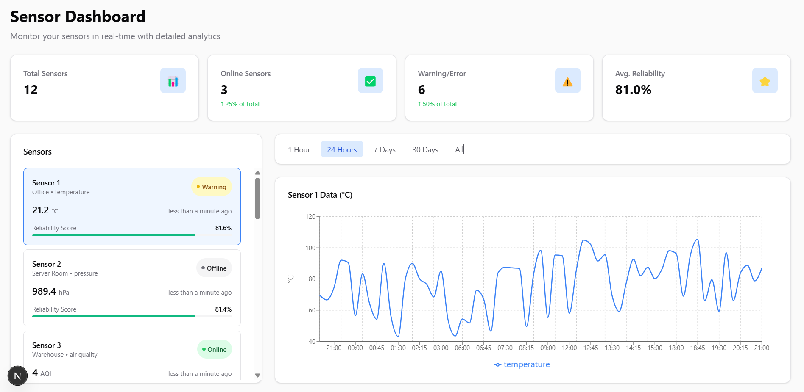

# aeoru-urban-monitor

## Overview

The `aeoru-urban-monitor` project is a real-time urban monitoring system designed to track and display sensor data. It includes a backend for managing sensor data and a frontend for visualizing the data in real-time. The system calculates a "reliability score" for each sensor based on data variance and update frequency.

---

## Features

### Backend

- **Language**: Python
- **Database**: MySQL
- **WebSocket Implementation**: Real-time data updates via WebSocket.
- **Error Handling & Logging**: Comprehensive error handling and logging for robust performance.
- **Reliability Score**: Calculates a reliability score for each sensor based on:
  - **Data Variance**: Measures the consistency of sensor readings.
  - **Update Frequency**: Evaluates how regularly the sensor sends data.

### Frontend

- **Framework**: React
- **Real-Time Data Display**: Displays live sensor data updates.
- **Charts/Graphs**: Visualizes sensor data using basic charts and graphs.
- **Responsive Design**: Optimized for desktop and mobile devices.
- **Error State Handling**: Displays error states for offline or malfunctioning sensors.

---

## Setup Instructions

### Prerequisites

- **Backend**:
  - Python 3.7+
  - MySQL database
  - Required Python libraries (install via `requirements.txt`).
- **Frontend**:
  - Node.js and npm/yarn.

### Backend Setup

1. Clone the repository:
   ```bash
   git clone https://github.com/<your-username>/aeoru-urban-monitor.git
   cd aeoru-urban-monitor/backend
   ```

````

2. Install dependencies:
   ```bash
   pip install -r requirements.txt
   ```
3. Configure the database:
   - Update the database connection settings in `config.py`.
   - Run migrations to create the required tables:
     ```bash
     alembic upgrade head
     ```
4. Start the backend server:
   ```bash
   uvicorn main:app --reload
   ```

### Frontend Setup

1. Navigate to the frontend directory:
   ```bash
   cd ../frontend
   ```
2. Install dependencies:
   ```bash
   npm install
   ```
3. Start the development server:
   ```bash
   npm start
   ```

---

## How It Works

1. **Backend**:

   - The backend receives sensor data via WebSocket.
   - It calculates the reliability score for each sensor based on data variance and update frequency.
   - The data is stored in a MySQL database and broadcasted to connected clients in real-time.

2. **Frontend**:

   - The frontend connects to the backend WebSocket to receive live updates.
   - It displays sensor data in real-time using charts and graphs.
   - It highlights sensors with warnings or errors.

3. **Simulate Sensor data**:
   -In order to let whole system to work, there is python script which lets you create mock data and emit to the backend server using websockets
   -The script accepts data using system arguments and randomizing the values

---

## Dashboard View

Below is a preview of the real-time sensor monitoring dashboard:


````
